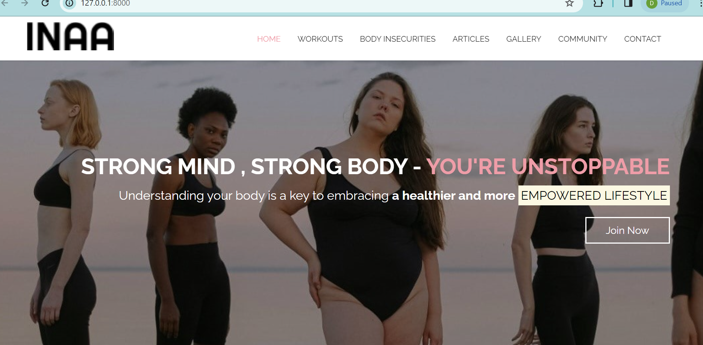

# 🎗️ INAA: Empowering Women's Wellness 🎗️
> Understanding your body
is key to embracing a healthier and more empowered lifestyle.

## 🌟 About INAA
INAA is a comprehensive wellness platform designed **specifically for women of all ages**. Our mission is to provide detailed, accurate, and engaging content about various workouts, enabling women to exercise safely and effectively. 

We understand that many women start their fitness journey without the necessary guidance or resources. INAA aims to bridge this gap by offering in-depth workout descriptions, nutritional articles, and a supportive community to help women everywhere make informed decisions about their health and wellness.

## 🏋️‍♀️ Workout Guides 
From Yoga to Pilates, and everything in between, our workout guides provide detailed instructions, ensuring our users have the knowledge they need to exercise safely and effectively.

## 🍎 Nutrition Articles 
Our comprehensive articles cover a range of nutrition topics, empowering our users to make informed decisions about their dietary habits.

## 🌐 Our Community 
Join our vibrant community of women supporting each other through our dedicated INAA servers. Here, you can share experiences, ask questions, and find support from women worldwide.

## 📊 Community Stats
- Active Users: 
- Community Members: 
- Articles Published: 
- Workout Guides: 

## 🤝 Contributing
We welcome contributions from everyone. If you're interested in improving INAA, feel free to fork the repository and submit a pull request.

## 📬 Contact Us
For any questions or concerns, please open an issue on GitHub or reach out to us through our INAA community servers.
**Join us at INAA, where we believe in empowering every woman to take control of her wellness journey.**
